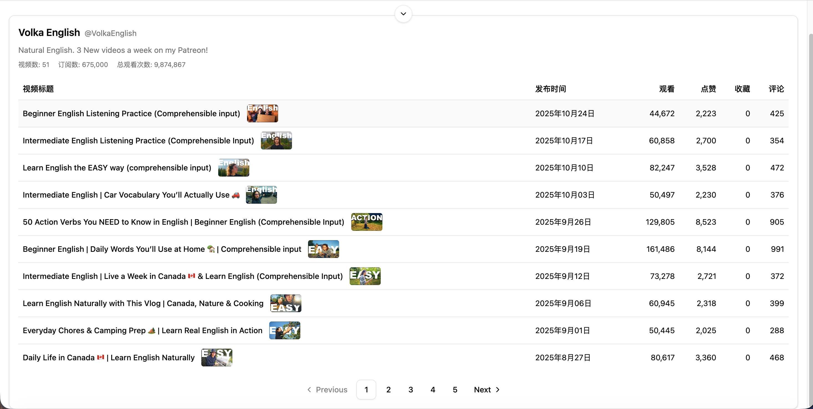

# YouTube 频道分析项目

## 功能介绍

- 支持按频道名称或 @handle 搜索，自动请求 YouTube Data API 获取频道元数据与视频列表
- 可切换全站搜索模式并显示搜索建议，提供更精确的频道选择体验
- 展示频道简介、订阅数、视频总数、总观看数等关键指标
- 视频列表按发布时间倒序排列，包含观看、点赞、收藏、评论等统计，并支持分页浏览
- 通过骨架屏与空状态组件提供有反馈的加载体验，并在搜索面板中加入折叠与确认弹窗交互

## 功能截图

<!-- TODO: 在此添加项目截图，例如使用 Markdown 图片语法或 HTML 标签 -->




## 技术栈说明

| 技术           | 图标                                                                                                                                                 | 说明                                             |
| -------------- | ---------------------------------------------------------------------------------------------------------------------------------------------------- | ------------------------------------------------ |
| React 19       |                          | 构建组件化用户界面，处理搜索与列表的交互逻辑     |
| TypeScript     |           | 提供静态类型约束，提升开发阶段的可维护性与可读性 |
| Vite           |                         | 作为构建工具，提供极速开发服务器与按需打包能力   |
| Tailwind CSS 4 |  | 通过原子化样式快速构建响应式界面                 |
| Radix UI       |                                        | 提供无障碍的基础组件（如对话框、开关、选择器等） |
| Lucide Icons   |                     | 统一的矢量图标库，增强界面视觉反馈               |

## 更新日志

### v0.0.0

- 初始化项目结构（React + TypeScript + Vite）与基础开发环境
- 新增频道搜索、建议列表、全站搜索确认弹窗等基础交互
- 接入 YouTube Data API v3，展示频道元数据与视频统计
- 实现视频分页、骨架屏加载状态与空状态反馈

## 快速开始

### 环境准备

- Node.js 18 或以上版本
- 有效的 YouTube Data API v3 Key

### 本地运行

1. 安装依赖
   ```bash
   npm install
   ```
2. 配置环境变量，在项目根目录创建 `.env.local`（或 `.env`）文件并写入：
   ```bash
   VITE_YOUTUBE_API_KEY=你的_API_Key
   ```
3. 启动开发服务器
   ```bash
   npm run dev
   ```
4. 打开浏览器访问终端输出的地址（默认 `http://localhost:5173`）开始调试

### 构建与预览

```bash
npm run build
npm run preview
```

## Docker 部署

- 构建镜像（将 `你的_API_Key` 替换为有效的 YouTube Data API Key）
  ```bash
  docker build --build-arg VITE_YOUTUBE_API_KEY=你的_API_Key -t youtube-analysis:latest .
  ```
- 启动容器并映射到本机端口（此例中访问地址为 http://localhost:8080）
  ```bash
  docker run -d --name youtube-analysis -p 8080:80 youtube-analysis:latest
  ```
- 更新镜像时可先停止并移除旧容器
  ```bash
  docker stop youtube-analysis && docker rm youtube-analysis
  docker build --build-arg VITE_YOUTUBE_API_KEY=新的_API_Key -t youtube-analysis:latest .
  docker run -d --name youtube-analysis -p 8080:80 youtube-analysis:latest
  ```
- 若需在构建阶段读取本地 `.env` 文件中的 Key，可配合 `--build-arg VITE_YOUTUBE_API_KEY=$(grep ...)` 或使用 CI/CD 密钥管理；镜像构建完成后即为纯静态资源，运行阶段无需额外环境变量。

## 🪪 许可证

This project is licensed under the [MIT License](./LICENSE) — feel free to use and modify with attribution.
