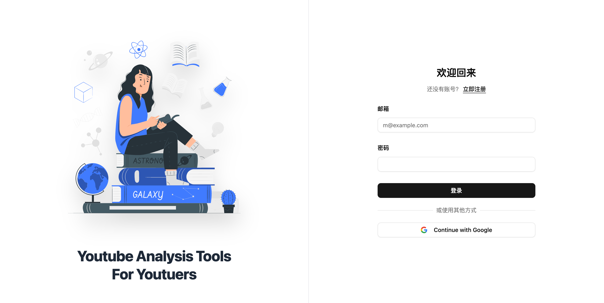
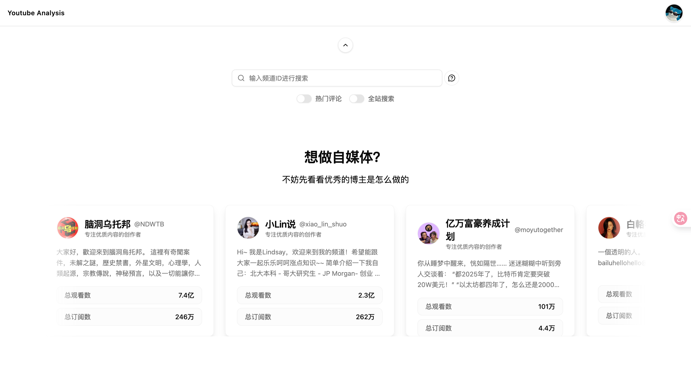
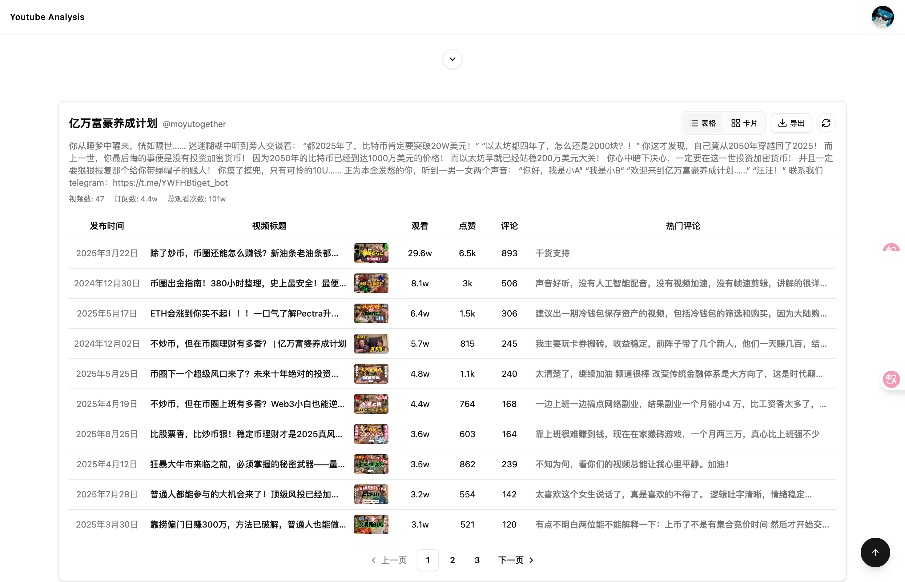
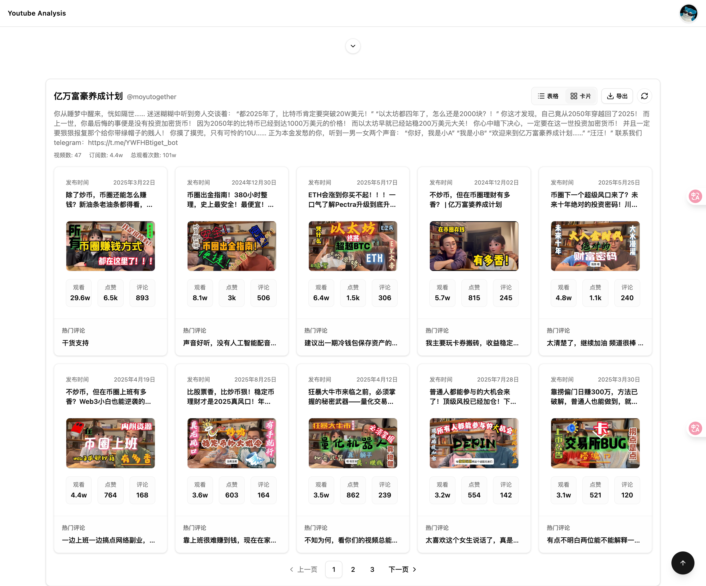
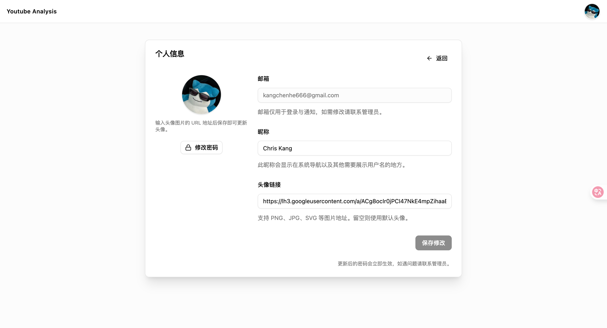

# YouTube 频道分析项目

本仓库提供项目的前端实现，需与配套后端服务结合使用，后端代码仓库：https://github.com/kangchainx/youtube-analysis-backend

## 功能介绍

- 支持按频道名称或 @handle 搜索，自动请求 YouTube Data API 获取频道元数据与视频列表
- 可切换全站搜索模式并显示搜索建议，提供更精确的频道选择体验
- 展示频道简介、订阅数、视频总数、总观看数等关键指标
- 视频列表按发布时间倒序排列，包含观看、点赞、收藏、评论等统计，并支持分页浏览
- 通过骨架屏与空状态组件提供有反馈的加载体验，并在搜索面板中加入折叠与确认弹窗交互

如果你喜欢这个项目或者它对你有帮助，请点亮一个 star，每一个 star 对我意义非凡。

If you enjoy this project or find it helpful, please consider giving it a star; each one means a great deal to me.

## 功能截图

<!-- TODO: 在此添加项目截图，例如使用 Markdown 图片语法或 HTML 标签 -->








## 技术栈说明

| 技术           | 图标                                                                                                                                                 | 说明                                             |
| -------------- | ---------------------------------------------------------------------------------------------------------------------------------------------------- | ------------------------------------------------ |
| React 19       |                          | 构建组件化用户界面，处理搜索与列表的交互逻辑     |
| TypeScript     |           | 提供静态类型约束，提升开发阶段的可维护性与可读性 |
| Vite           |                         | 作为构建工具，提供极速开发服务器与按需打包能力   |
| Tailwind CSS 4 |  | 通过原子化样式快速构建响应式界面                 |
| Radix UI       |                                        | 提供无障碍的基础组件（如对话框、开关、选择器等） |
| Lucide Icons   |                     | 统一的矢量图标库，增强界面视觉反馈               |

## 更新日志

### v0.0.0

- 初始化项目结构（React + TypeScript + Vite）与基础开发环境
- 新增频道搜索、建议列表、全站搜索确认弹窗等基础交互
- 接入 YouTube Data API v3，展示频道元数据与视频统计
- 实现视频分页、骨架屏加载状态与空状态反馈

## 快速开始

### 环境准备

- Node.js 18 或以上版本
- 必须搭配后端服务（https://github.com/kangchainx/youtube-analysis-backend），前端将在运行时优先读取 `GET /api/config/youtube-api-key` 接口（返回 `{ "youtubeApiKey": "<你的 Key>" }`）
- 备选方案：在项目根目录创建 `.env.local`（或 `.env`）文件并写入
  ```bash
  VITE_YOUTUBE_API_KEY=你的_API_Key
  ```
  该方式仅在后端接口不可用时作为兜底使用

### 本地运行

1. 安装依赖
   ```bash
   npm install
   ```
2. 如使用后端接口，确保其已可通过默认地址 `http://localhost:5001`（或设置 `VITE_API_BASE_URL` 指向新地址）访问
3. 启动开发服务器
   ```bash
   npm run dev
   ```
4. 打开浏览器访问终端输出的地址（默认 `http://localhost:5173`）开始调试

### 构建与预览

```bash
npm run build
npm run preview
```

## Docker 部署

### 单独部署前端静态资源（单独部署可能无法使用完整功能，建议结合后端的一键部署（docker-compose））

- 构建镜像（自行传入 `VITE_YOUTUBE_API_KEY`）：
  ```bash
  docker build \
    --build-arg VITE_YOUTUBE_API_KEY=你的_API_Key \
    -t youtube-analysis:latest .
  ```
- 启动容器并映射端口（默认访问地址 http://localhost:8080）：
  ```bash
  docker run -d --name youtube-analysis -p 8080:80 youtube-analysis:latest
  ```
- 更新镜像时可先停止并移除旧容器，然后重新构建、启动：
  ```bash
  docker stop youtube-analysis && docker rm youtube-analysis
  docker build --build-arg VITE_YOUTUBE_API_KEY=新的_API_Key -t youtube-analysis:latest .
  docker run -d --name youtube-analysis -p 8080:80 youtube-analysis:latest
  ```

### 结合后端的一键部署（docker-compose）

仓库已提供 `docker-compose.yml`，可同时启动前端与后端代理，解决本地跨域问题。

1. **前置准备**
   - 确保已完成后端镜像构建（在 [后端仓库](https://github.com/kangchainx/youtube-analysis-backend) 根目录执行）：
     ```bash
     docker build -t youtube-analysis-backend:latest .
     ```
   - 确认宿主机可访问后端依赖（PostgreSQL、Google OAuth 等），并在需要时调整 `docker-compose.yml` 中的环境变量。

2. **启动服务**

   ```bash
   BACKEND_IMAGE=youtube-analysis-backend:latest docker-compose up --build
   ```

   - 若希望后台运行，追加 `-d` 即可：
     ```bash
     BACKEND_IMAGE=youtube-analysis-backend:latest docker-compose up --build -d
     ```
   - 停止并清理容器：
     ```bash
     docker-compose down
     ```

3. **访问应用**
   - 浏览器访问 `http://localhost:8080`。
   - 前端内部会将 `/api/*` 请求通过 Nginx 反向代理转发到后端容器，因此无需再配置额外的 CORS。

4. **环境变量说明**
   - `BACKEND_IMAGE`：后端镜像名（默认示例为 `youtube-analysis-backend:latest`）。
   - 启动 `docker-compose` 前，请在当前 Shell 或 `.env` 文件中设置 `GOOGLE_CLIENT_ID`、`GOOGLE_CLIENT_SECRET` 与 `YOUTUBE_API_KEY`。这些值需要你在 [Google 开发者平台](https://console.cloud.google.com/) 创建 OAuth 2.0 Client 与 API Key 后自行获取，并与后端配置保持一致。
     ```bash
     export GOOGLE_CLIENT_ID=从 Google 开发者平台获取的 OAuth Client ID
     export GOOGLE_CLIENT_SECRET=从 Google 开发者平台获取的 OAuth Client Secret
     export YOUTUBE_API_KEY=从 Google 开发者平台获取的 YouTube Data API Key
     ```
   - `docker-compose.yml` 中已内置后端运行所需的全部环境变量，如需修改（例如数据库地址、OAuth 回调 URL）可直接在文件中调整。
   - 构建前端镜像时仍可选地设置 `VITE_YOUTUBE_API_KEY`，命令示例：
     ```bash
     VITE_YOUTUBE_API_KEY=你的_API_Key \
     BACKEND_IMAGE=youtube-analysis-backend:latest \
       docker-compose up --build
     ```
   - 若需刷新前端镜像，可执行：
     ```bash
     docker build -t youtube-analysis-frontend:latest .
     docker-compose down
     BACKEND_IMAGE=youtube-analysis-backend:latest docker-compose up --build
     ```

> 提示：如需在生产环境部署，建议将 OAuth 密钥、数据库凭据等敏感信息改为使用安全的密钥管理方案（例如 Docker secrets 或云端参数服务），并为后端镜像配置独立的 `.env` 或环境注入流程。

## 🪪 许可证

This project is licensed under the [MIT License](./LICENSE) — feel free to use and modify with attribution.
