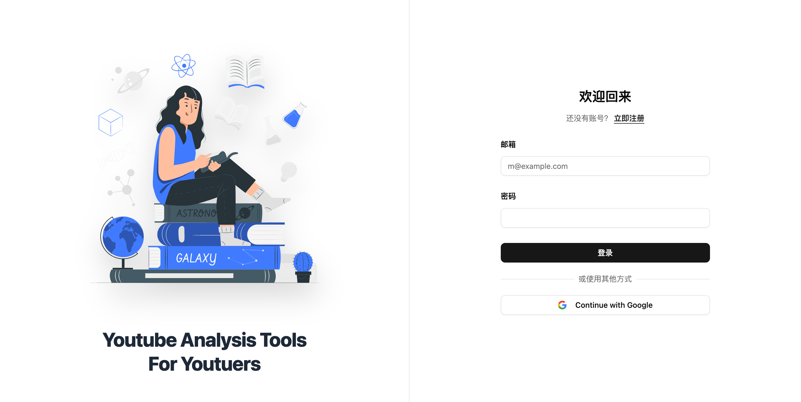
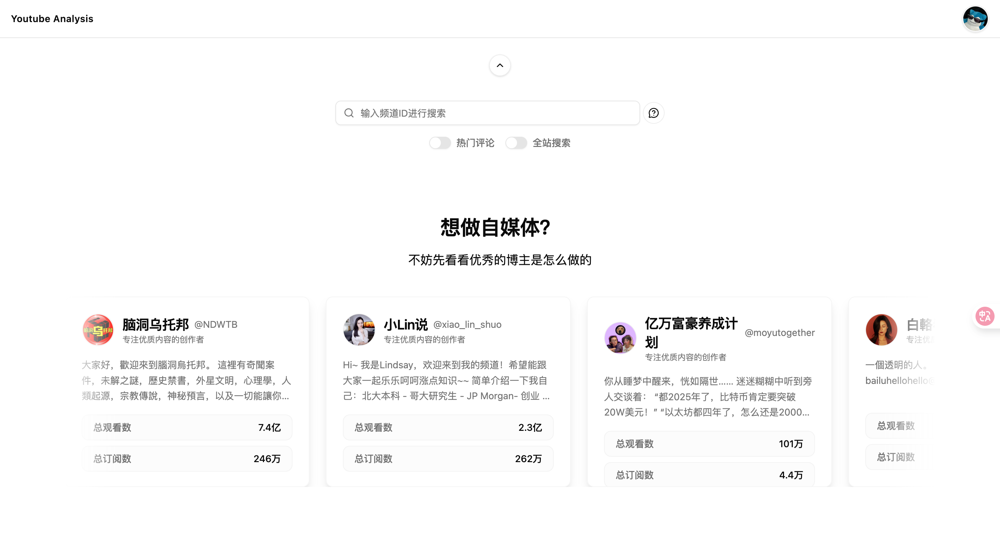
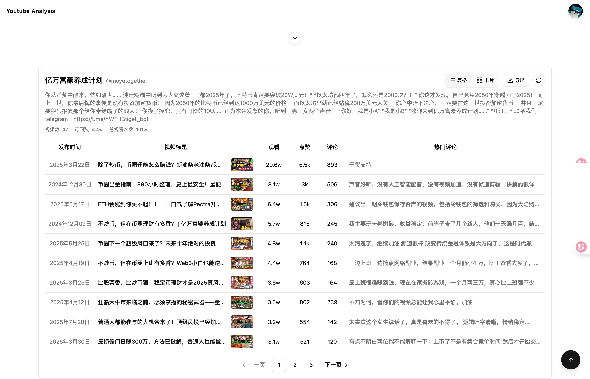
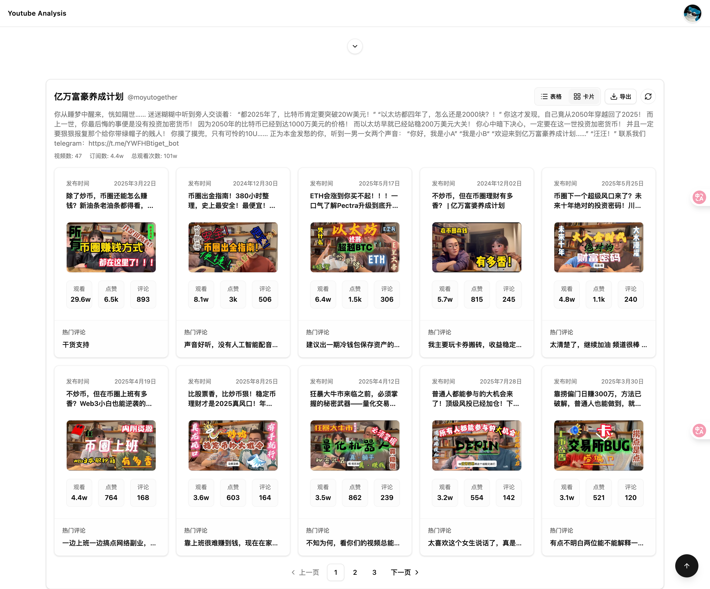
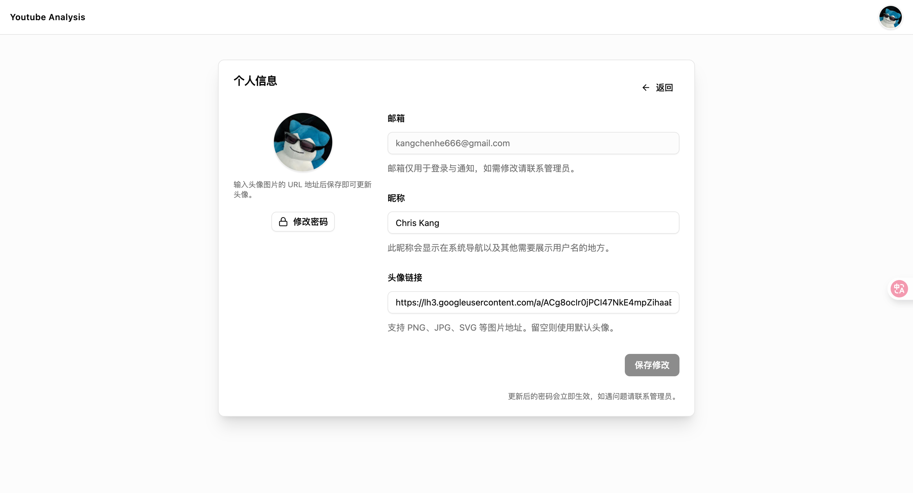

<div align="center">

[](https://github.com/kangchainx/youtube-analysis-project)

<!-- 徽章 -->
<p>
  <a href="./LICENSE">
    
  </a>
  <a href="https://github.com/kangchainx/youtube-analysis-project/stargazers">
    
  </a>
  <a href="https://github.com/kangchainx/youtube-analysis-project/network/members">
    
  </a>
  <a href="https://github.com/kangchainx/youtube-analysis-project/issues">
    
  </a>
</p>

<!-- 语言切换 -->
<p>
  <a href="./README.md">English</a> | <strong>中文</strong>
</p>

</div>

---

## 📊 YouTube 分析平台

现代化的 YouTube 频道分析与视频转写面板。基于 React 19 + TypeScript + Vite 构建，支持实时 SSE 更新、频道数据分析、视频转写任务和通知系统。

**配套后端仓库**：[youtube-analysis-backend](https://github.com/kangchainx/youtube-analysis-backend)

**AI 视频翻译服务**：[video-transcriber](https://github.com/kangchainx/video-transcriber)

> 如果这个项目对你有帮助，请点亮一个 Star 🌟，你的支持是我持续维护的动力！

## ✨ 主要特性

- **📈 频道搜索与洞察**：按频道名称或 @handle 搜索，展示订阅数、观看数、视频数等关键指标，支持表格/卡片双视图与分页
- **🎬 转写任务中心**：通过 `/api/video-translate/*` 创建与跟踪视频转写任务，SSE 实时进度流，完成后可下载 Markdown/TXT 格式结果
- **🔔 通知流**：基于 SSE 的任务/系统通知推送，未读数实时更新，支持批量/单条标记已读
- **🏥 服务健康面板**：仪表盘内展示转写服务状态，支持一键刷新，暗黑模式适配
- **♿ 响应式与可访问性**：基于 Radix UI + Tailwind CSS 构建，提供骨架屏、空状态、完整深浅色主题支持
- **🚀 一键部署**：提供 Dockerfile 与 docker-compose，支持前后端联动部署与本地反向代理

## 🎬 演示

<div align="center">
  
</div>

## 🚀 快速开始

### 环境准备

- Node.js 18+（推荐 LTS 版本）
- 配套后端：[youtube-analysis-backend](https://github.com/kangchainx/youtube-analysis-backend)（默认 API 基址 `http://localhost:5001`）
- 可选：在项目根目录创建 `.env.local` 或 `.env`：

```bash
VITE_API_BASE_URL=http://localhost:5001    # 自定义后端地址
# 仅当后端未提供 /api/config/youtube-api-key 时，才使用本地 Key 兜底
VITE_YOUTUBE_API_KEY=你的_YouTube_API_Key
```

### 本地开发

```bash
npm install
npm run dev
# 浏览器访问 http://localhost:5173
```

**常用脚本**：
- `npm run lint` - 代码质量检查
- `npm run build` - 构建产物
- `npm run preview` - 本地预览生产构建

### Docker 部署

**仅前端**（需自备后端或 API 代理）：

```bash
docker build -t youtube-analysis-frontend:latest .
docker run -d -p 8080:80 --name youtube-frontend youtube-analysis-frontend:latest
```

**前后端一键部署**（推荐 - 需先构建后端镜像）：

```bash
BACKEND_IMAGE=youtube-analysis-backend:latest docker-compose up --build
# 后台运行：添加 -d 参数
```

## 📸 功能截图

<details>
<summary>点击查看截图</summary>








</details>

## 🛠️ 技术栈

- **前端框架**：React 19.1.1 + TypeScript 5.6
- **构建工具**：Vite 7
- **路由**：React Router 7.9.4
- **UI 组件**：Radix UI + Tailwind CSS 4 + shadcn/ui
- **图表**：Recharts 3.4.1
- **实时通信**：Server-Sent Events (SSE)
- **图标**：Lucide Icons
- **通知**：Sonner Toast

## 🗺️ 路由结构

- `/login` - 用户登录
- `/register` - 用户注册
- `/home` - 频道搜索与发现
- `/detail/:videoId` - 视频详情与转写创建
- `/profile` - 用户资料设置
- `/workbench/dashboard` - 指标概览 + 服务健康
- `/workbench/subscriptions` - 频道订阅管理
- `/workbench/analytics` - 频道数据分析
- `/workbench/tasks` - 转写任务中心（SSE 实时更新）
- `/workbench/notifications` - 通知中心（SSE 推送）

## 🤝 贡献指南

欢迎提交 Issue 和 Pull Request！提交前请确保：

```bash
npm run lint
npm run build
```

## 📄 许可证

MIT License - 详见 [LICENSE](./LICENSE)。欢迎二次开发与商用，保留版权与链接即可。

---

<div align="center">

**Made with ❤️ by [kangchainx](https://github.com/kangchainx)**

</div>
